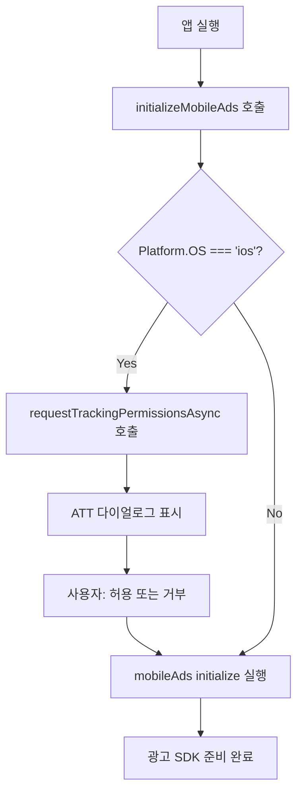

# [2026-03-28] App Store 심사 거절 원인 분석 및 ATT 수정 기록

이 문서의 목표: App Store 지침 2.1 위반으로 인한 심사 거절 원인을 정확히 파악하고, ATT(App Tracking Transparency) 권한 요청 누락 문제를 수정한 과정을 기록한다.

---

## 배경

### 프로젝트 환경

- 프레임워크: React Native + Expo
- 광고 SDK: `react-native-google-mobile-ads` v16.3.0 (AdMob — Google의 모바일 광고 플랫폼)
- 플랫폼: iOS (App Store 심사 대상)

### 거절 상황

App Store 심사에서 **지침 2.1 (앱 완성도)** 위반으로 반려되었다. Apple 심사 팀이 명시한 거절 사유는 다음과 같다.

> "AppTrackingTransparency 프레임워크를 사용하지만 iOS 26.4에서 ATT 권한 요청 다이얼로그가 표시되지 않음"

ATT (App Tracking Transparency, 앱 추적 투명성):
Apple이 iOS 14.5부터 도입한 프레임워크. 앱이 사용자를 추적하기 전에 반드시 명시적 동의를 받도록 강제한다. 광고 타겟팅에 쓰이는 IDFA(광고 식별자)에 접근하려면 이 프레임워크를 통한 권한 요청이 필수다.

---

## 목표

1. ATT 다이얼로그가 표시되지 않은 기술적 원인을 규명한다.
2. `services/ads.ts` 코드를 수정하여 권한 요청이 올바르게 동작하도록 한다.
3. App Store 심사 재제출 시 필요한 사항을 정리한다.

---

## 본문

### 1. 문제 원인 분석

#### 1-1. 잘못 이해하기 쉬운 부분: `NSUserTrackingUsageDescription`

`Info.plist` (iOS 앱의 설정 파일. 앱 권한 설명, 번들 ID 등 메타정보를 담는다) 에
`NSUserTrackingUsageDescription` 키는 이미 올바르게 설정되어 있었다.

그러나 이 키는 **다이얼로그에 표시될 설명 문자열을 등록하는 것**일 뿐이다.
이 값만 설정한다고 해서 다이얼로그가 자동으로 뜨지 않는다.

| 설정 항목 | 역할 | 다이얼로그 표시 여부 |
|---|---|---|
| `NSUserTrackingUsageDescription` | 다이얼로그에 표시될 안내 문구 등록 | 직접 관련 없음 |
| `ATTrackingManager.requestTrackingAuthorization()` 호출 | 실제 다이얼로그를 사용자에게 표시 | **이것이 필수** |

#### 1-2. 실제 누락된 것: 명시적 권한 요청 API 호출

`services/ads.ts`의 `initializeMobileAds()` 함수는 단순히 `mobileAds().initialize()`만 호출하고 있었다.

```ts
// 수정 전 - ATT 권한 요청 없이 광고만 초기화
export const initializeMobileAds = () => {
    if (!initializePromise) {
        initializePromise = mobileAds().initialize()
    }
    return initializePromise
}
```

`ATTrackingManager.requestTrackingAuthorization()` (또는 JS 래퍼인 `requestTrackingPermissionsAsync`) 를
코드 어디에서도 명시적으로 호출하지 않았다.

#### 1-3. SDK 버전 변경에 의한 동작 차이

`react-native-google-mobile-ads`의 구버전에서는 `initialize()` 내부에서 ATT 요청을 자동으로 트리거했다.
그러나 **iOS 17 이상, iOS 26에서는 이 자동 트리거 동작이 제거되었다.**

결과적으로 앱 바이너리에 ATT 프레임워크가 링크되어 있음에도 불구하고, 사용자에게 권한 요청 다이얼로그가 표시되지 않는 상태가 되었다.

```
앱 실행
  └─ initializeMobileAds() 호출
       └─ mobileAds().initialize() 만 실행
            └─ ATT 다이얼로그 없음 (누락)
                 └─ Apple 심사: "프레임워크는 있는데 다이얼로그 없음" → 거절
```

---

### 2. 해결 방법

#### 2-1. 패키지 설치

`expo-tracking-transparency` (Expo에서 공식 지원하는 ATT 권한 요청 래퍼 패키지):

```bash
npx expo install expo-tracking-transparency
```

설치 후 iOS 네이티브 모듈을 연결하기 위해 `pod install`을 실행한다.

```bash
cd ios && pod install
```

CocoaPods (pod): iOS 앱의 의존성 관리 도구. `pod install`은 네이티브 라이브러리를 프로젝트에 연결한다.

#### 2-2. `services/ads.ts` 수정

ATT 권한 요청은 반드시 `mobileAds().initialize()` **이전에** 완료되어야 한다.
광고 SDK가 초기화될 때 이미 추적 동의 여부를 확인하기 때문이다.

**수정 전:**

```ts
export const initializeMobileAds = () => {
    if (!initializePromise) {
        initializePromise = mobileAds().initialize()
    }
    return initializePromise
}
```

**수정 후:**

```ts
import { requestTrackingPermissionsAsync } from 'expo-tracking-transparency'

export const initializeMobileAds = async () => {
    // iOS에서만 ATT 권한 요청 (Android는 ATT 프레임워크 없음)
    if (Platform.OS === 'ios') {
        await requestTrackingPermissionsAsync()
    }

    // ATT 요청 완료 후 광고 SDK 초기화
    if (!initializePromise) {
        initializePromise = mobileAds().initialize()
    }

    return initializePromise
}
```

변경 포인트 요약:

| 항목 | 수정 전 | 수정 후 |
|---|---|---|
| 함수 시그니처 | 동기 함수 | `async` 함수 |
| ATT 요청 | 없음 | iOS에서 `await requestTrackingPermissionsAsync()` |
| 광고 초기화 순서 | 즉시 실행 | ATT 완료 후 실행 |

#### 2-3. 동작 흐름 (수정 후)



---

### 3. App Store 심사 재제출 시 참고사항

#### 3-1. 빌드 및 업로드

1. 수정된 코드로 새 빌드를 생성한다.
2. TestFlight (Apple의 베타 배포 플랫폼. 심사 전 내부 테스트 및 심사용 빌드 업로드에 사용됨) 에 업로드한다.
3. App Store Connect에서 해당 빌드를 심사 제출 대상으로 선택한다.

#### 3-2. 심사용 화면 녹화 첨부

Apple 심사 팀이 화면 녹화를 요청했으므로, 아래 흐름을 실기기에서 녹화하여 심사 메모에 첨부한다.

```
실기기에서 앱 삭제
  → 앱 재설치
  → 앱 최초 실행
  → ATT 다이얼로그 표시 확인
  → 허용 또는 거부 선택
  → 정상적으로 앱 실행되는 것 확인
```

주의: 이미 한 번 ATT 권한을 응답한 기기에서는 다이얼로그가 다시 표시되지 않는다. 반드시 앱을 삭제 후 재설치해야 다이얼로그를 다시 볼 수 있다.

#### 3-3. App Store Connect 개인정보 보호 정보 확인

App Store Connect > 앱 개인정보 보호 정보에서 "추적" 항목이 올바르게 선언되어 있는지 확인한다.
IDFA (Identifier For Advertisers, 광고 식별자. Apple이 각 기기에 부여하는 고유 ID로, 광고 타겟팅에 활용됨) 수집 여부와 목적이 실제 코드 동작과 일치해야 한다.

---

## 요약

### 핵심 교훈

1. **`NSUserTrackingUsageDescription` 설정만으로는 불충분하다.**
   이 키는 다이얼로그에 표시될 설명 문자열을 등록하는 것이지, 다이얼로그를 표시하는 트리거가 아니다.

2. **ATT 다이얼로그를 표시하려면 코드에서 명시적으로 권한 요청 API를 호출해야 한다.**
   `requestTrackingPermissionsAsync()` (또는 네이티브의 `ATTrackingManager.requestTrackingAuthorization()`)를 반드시 직접 호출해야 한다.

3. **광고 SDK 초기화 이전에 ATT 요청이 완료되어야 한다.**
   순서가 바뀌면 SDK가 추적 동의 여부를 알 수 없는 상태에서 초기화되며, Apple 심사 기준을 충족하지 못할 수 있다.

4. **SDK 자동 트리거에 의존하면 안 된다.**
   `react-native-google-mobile-ads` 구버전의 자동 ATT 트리거는 최신 iOS에서 동작하지 않는다. 항상 명시적으로 호출하는 것이 안전하다.

---

## 참조

- [expo-tracking-transparency 공식 문서](https://docs.expo.dev/versions/latest/sdk/tracking-transparency/)
- [react-native-google-mobile-ads 문서](https://docs.page/invertase/react-native-google-mobile-ads)
- [Apple ATT 프레임워크 공식 문서](https://developer.apple.com/documentation/apptrackingtransparency)
- [App Store Review Guidelines 2.1](https://developer.apple.com/app-store/review/guidelines/#performance)
